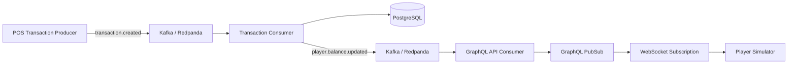
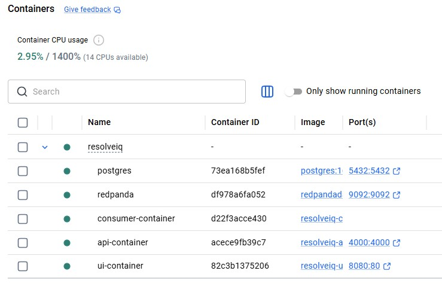
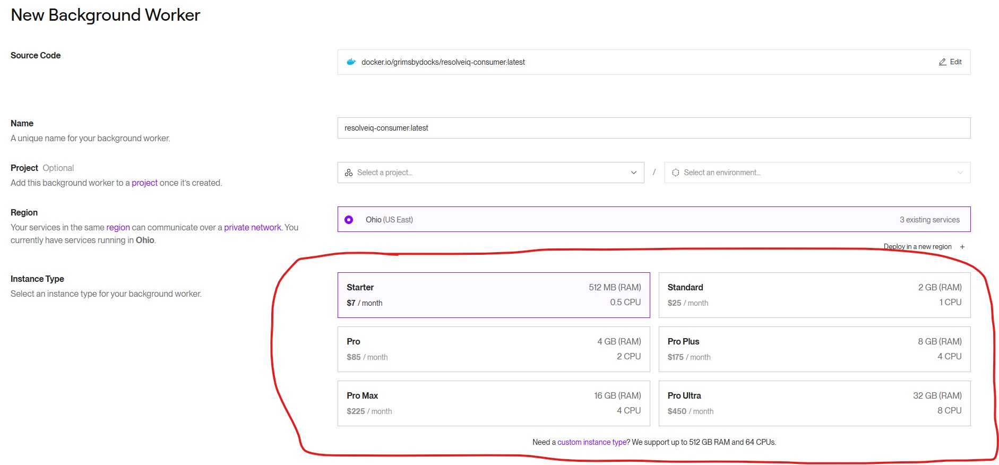
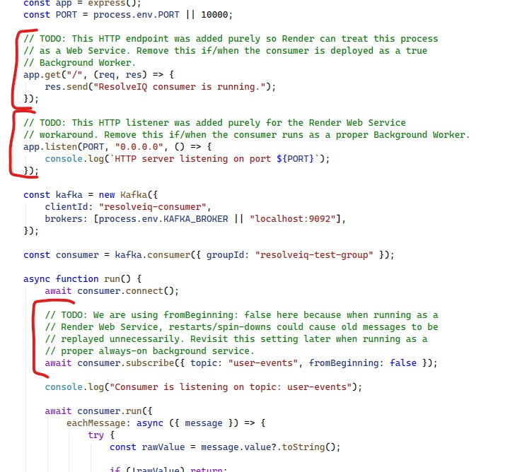

# ResolveIQ

> Event-driven loyalty assurance and service recovery for missed points, failed transactions, and customer-impacting exceptions.

**Live UI:** https://resolveiq-ui.onrender.com  
**Live GraphQL API:** https://resolveiq-t6iy.onrender.com

ResolveIQ is a full-stack loyalty operations platform designed to help support teams detect, investigate, and resolve loyalty issues before they become long-running customer complaints.

It combines an operational dashboard, a player simulator, GraphQL APIs, Kafka-based event processing, PostgreSQL persistence, and real-time WebSocket subscriptions into one end-to-end workflow.

---

## Why ResolveIQ Exists

In many loyalty environments, missed points are still handled through a mixture of spreadsheets, email threads, manual database checks, and fragile replay processes.

A customer notices that points are missing. Support begins an investigation. A technical analyst may then need to find the original transaction, determine whether the account was eligible, replay data, and confirm that the balance eventually changed.

That creates predictable problems:

- no shared investigation queue;
- limited visibility into unresolved issues;
- inconsistent handling between support representatives;
- manual technical intervention for routine recovery;
- weak auditability;
- no reliable measure of time to resolution;
- poor communication back to the customer.

ResolveIQ replaces that fragmented process with a structured, event-driven workflow.

---

## What the Platform Demonstrates Today

ResolveIQ currently supports a working event flow from a simulated point-of-sale transaction through to a live balance update in the browser.

A transaction generated by the POS simulator is published to Kafka. The transaction consumer validates and processes it, writes the transaction to PostgreSQL, applies the resulting loyalty points, and emits a secondary `player.balance.updated` event. The GraphQL API consumes that event and forwards it through an in-memory PubSub layer to subscribed browser clients.

The Player Simulator updates immediately without refreshing the page.



This proves the complete asynchronous path:

```text
POS producer
→ transaction.created
→ Kafka
→ transaction consumer
→ PostgreSQL update
→ player.balance.updated
→ Kafka
→ GraphQL API consumer
→ GraphQL subscription
→ live browser update
```

---

## Product Capabilities

### Loyalty operations dashboard

The operational dashboard is intended to give loyalty support teams a structured place to investigate customer-impacting exceptions.

Current and planned workflow capabilities include:

- missed-points review;
- customer and transaction inspection;
- account-status checks;
- controlled points adjustments;
- transaction reprocessing decisions;
- audit-friendly transaction history;
- case and resolution tracking;
- supervisor visibility into open work and resolution times.

### Player Simulator

The Player Simulator demonstrates the customer-facing effect of loyalty activity.

It supports:

- selecting an existing player;
- retrieving the authoritative account balance from PostgreSQL;
- receiving live balance updates over GraphQL subscriptions;
- preserving the correct balance when switching between players;
- reacting immediately to transactions generated through the Kafka-based POS simulator.

The player-selection query is deliberately treated as selector data only. The current balance is always retrieved from the authoritative account query and then updated by newer subscription events.

### Event-driven transaction ingestion

The simulated POS system does not wait for ResolveIQ to synchronously complete all loyalty processing.

Instead, it publishes a `transaction.created` event and moves on. This reflects how a high-volume external system could integrate without tightly coupling the customer checkout path to the loyalty platform.

The transaction consumer:

1. receives the Kafka event;
2. prevents duplicate event processing;
3. validates the incoming transaction;
4. locates the loyalty account;
5. writes the transaction;
6. calculates and applies earned points;
7. records the processed event;
8. publishes `player.balance.updated`.

---

## Architecture

ResolveIQ is split into independently deployable parts.

```text
resolveiq/
├── client/
│   └── userfrontend/          React, TypeScript, Vite and MUI
├── server/                    Apollo GraphQL API and subscriptions
├── streaming/
│   ├── consumer/              Kafka transaction and user consumers
│   └── producer/              Simulated POS and event producers
├── packages/
│   └── kafka/                 Shared internal Kafka package
├── docker-compose.yml
└── package.json
```

### Shared Kafka package

Kafka configuration and reusable consumer logic live in:

```text
packages/kafka
```

Both the GraphQL API and streaming consumers import the same internal package:

```js
const { runConsumer } = require("@resolveiq/kafka");
```

This avoids duplicated Kafka configuration and prevents separately deployed services from reaching into each other's internal folders.

### Backend

The backend is built with:

- Node.js;
- Apollo Server;
- GraphQL;
- Express;
- PostgreSQL;
- KafkaJS;
- GraphQL subscriptions;
- `graphql-ws`;
- WebSockets.

### Frontend

The frontend is built with:

- React;
- TypeScript;
- Vite;
- Material UI;
- Apollo Client;
- GraphQL queries and subscriptions.

### Data and messaging

- PostgreSQL is the authoritative store for users, transactions, processed events, and loyalty balances.
- Kafka/Redpanda transports domain events between independently running processes.
- GraphQL queries retrieve current state.
- GraphQL subscriptions deliver live state changes to the browser.

---

## Important Domain Events

### `transaction.created`

Published by the simulated POS producer.

Example:

```json
{
  "eventType": "transaction.created",
  "eventId": "generated-uuid",
  "occurredAt": "2026-08-05T18:00:00.000Z",
  "payload": {
    "id": 123456789,
    "username": "DSmith",
    "transactioncode": "TRAN",
    "gametype": "Slots",
    "amountwagered": 50.00,
    "transaction_timestamp": "2026-08-05T18:00:00.000Z"
  }
}
```

### `player.balance.updated`

Published after a transaction has been successfully processed and the database balance has changed.

Example:

```json
{
  "eventType": "player.balance.updated",
  "eventId": "generated-uuid",
  "occurredAt": "2026-08-05T18:00:01.000Z",
  "payload": {
    "username": "DSmith",
    "previousBalance": 1000,
    "newBalance": 1050,
    "pointsDelta": 50,
    "sourceTransactionId": 123456789,
    "sourceEventId": "original-transaction-event-id"
  }
}
```

This is a genuine domain event: it describes the fact that a player's resulting balance changed. The GraphQL API is one consumer of that fact, but other consumers could later use it for notifications, audit processing, analytics, or service-recovery workflows.

---

## Reliability and Idempotency

ResolveIQ records processed event IDs so duplicate Kafka deliveries do not create duplicate transactions or award points twice.

The current implementation performs:

```text
database update
→ publish player.balance.updated
```

For a production-grade deployment, the next reliability improvement would be a transactional outbox so the database change and the intent to publish the resulting event are committed atomically.

That limitation is understood and intentionally deferred while the platform remains in active product development.

---

## Getting Started Locally

### Prerequisites

- Git;
- Docker Desktop;
- Node.js and npm, if running tests outside Docker.

### Clone the repository

```bash
git clone https://github.com/Ted95153420/resolveiq.git
cd resolveiq
```

### Start the complete platform

Make sure Docker Desktop is running, then execute from the repository root:

```bash
docker compose up -d
```

Allow a few minutes for the services to build and start.

You should then see the ResolveIQ containers running in Docker Desktop:



### Stop the platform

```bash
docker compose down
```

### Rebuild after dependency or Dockerfile changes

```bash
docker compose build --no-cache
docker compose up -d
```

---

## Running the Tests

Run all commands from the repository root.

### Unit tests

```bash
npm run test:unit
```

`npm test` is also configured to run the unit suite.

### Frontend integration tests

```bash
npm run test:integration
```

### Complete test suite

```bash
npm run test:all
```

The test strategy deliberately separates:

- Jest unit tests for services, validators, event handlers, and Kafka publishers;
- Vitest and React Testing Library integration tests for frontend behaviour.

Key regression coverage includes ensuring that a player's authoritative balance remains correct after switching between players and reselecting the original player.

---

## Running the POS Transaction Producer

The transaction producer acts as a simulated external POS system.

Run it with the username of an existing ResolveIQ player:

```bash
node streaming/producer/transactionProducer.js DSmith
```

The producer publishes a `transaction.created` event. When the complete platform is running, the selected player's balance should update live in the Player Simulator.

---

## Production Demo Notes

The streaming consumers are currently deployed to Render as web services:

- https://resolveiq-consumer-latest.onrender.com
- https://resolveiq-transactions-consumer-latest.onrender.com

Before a production demo, visit each URL to wake the service. Render's free web services may spin down while inactive, so the first request can take additional time.

This is a cost-saving deployment workaround. The consumers are conceptually background workers, but paid Render background workers are intentionally avoided during the current development phase.



The consumer processes expose a minimal HTTP endpoint only so they can run as Render web services. Their real responsibility remains Kafka event consumption.



For a production deployment, these processes should run as continuously available background workers or containerized services.

---

## Database Reset for Controlled Demos

Resetting shared or deployed databases is destructive. Perform this only in an environment intended for demos or development.

Connect using your environment-specific credentials:

```bash
PGPASSWORD=<db-password> psql \
  -h <database-host> \
  -U <database-user> \
  <database-name>
```

The current schema includes users, transactions, and processed events. Keep schema changes aligned with the SQL and migration logic in the repository rather than relying on an old README copy.

---

## Current Scope

ResolveIQ is being developed as a generic loyalty assurance and service-recovery platform rather than as a dependency on one specific casino, POS, or loyalty vendor.

The current focus includes:

- loyalty transaction ingestion;
- balance calculation and adjustment;
- audit-friendly transaction history;
- real-time visibility;
- missed-points investigation;
- controlled recovery workflows.

Potential future integrations could include POS platforms, loyalty engines, Kafka-based enterprise services, and vendor-specific event streams.

---

## Roadmap

Near-term priorities include:

- stronger audit-trail presentation;
- richer exception and case workflows;
- customer communication support;
- transaction reprocessing;
- supervisor reporting;
- end-to-end automated testing;
- dead-letter and retry handling;
- transactional-outbox support;
- merchant and location modelling;
- real POS integration.

Longer-term possibilities include:

- case assignment and escalation;
- SLA tracking;
- customer notifications;
- duplicate and suspicious-activity review;
- delayed-processing analysis;
- multi-tenant support;
- pluggable loyalty rules;
- direct integrations with third-party loyalty and POS platforms.

---

## Why This Project Is Different

ResolveIQ is not simply a CRUD dashboard.

It demonstrates:

- product thinking grounded in a real operational problem;
- asynchronous, event-driven architecture;
- independently deployable services;
- shared internal packages;
- idempotent message handling;
- authoritative server-state management;
- live GraphQL subscriptions;
- Dockerized local development;
- unit and integration testing;
- a credible path from simulated data to real enterprise integration.

The goal is to build software that is technically convincing, operationally believable, and commercially relevant.

---

## Project Status

ResolveIQ is under active development.

The current platform already demonstrates a complete loyalty transaction journey from a simulated POS event to a persisted balance update and a live browser notification. The next phase is to deepen the investigation and service-recovery experience around that event-driven core.
